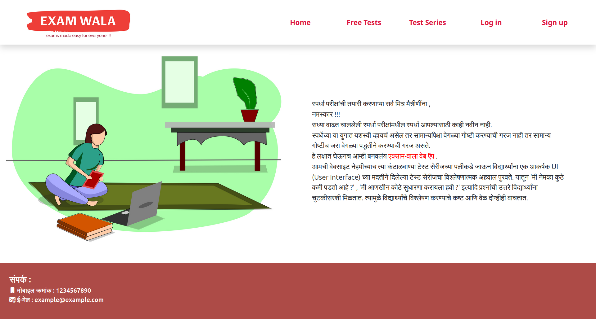
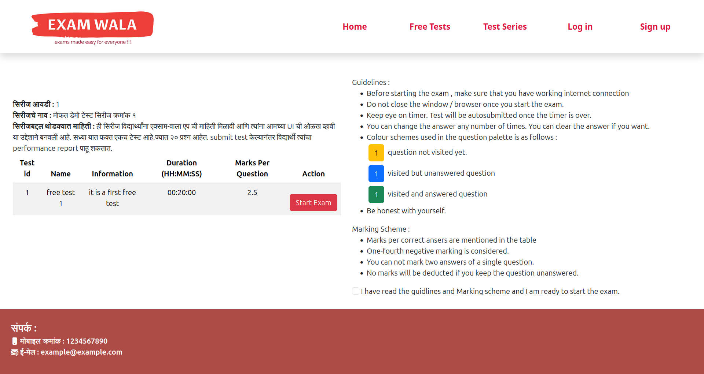
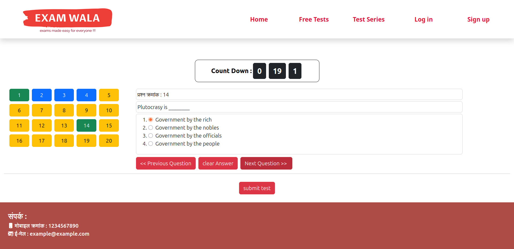
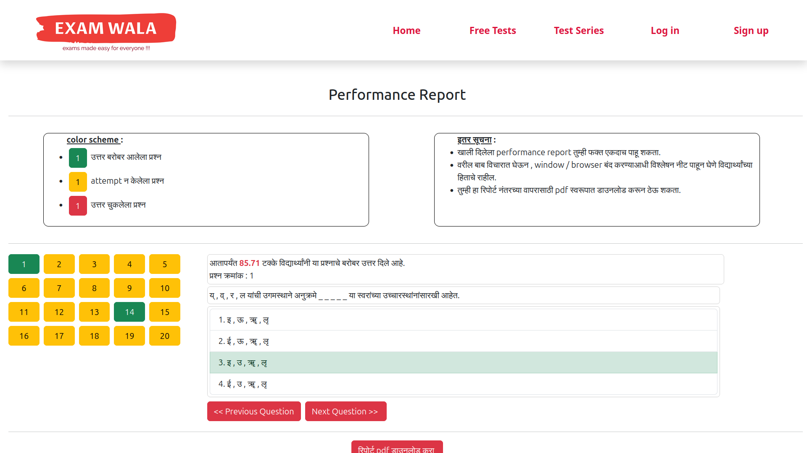
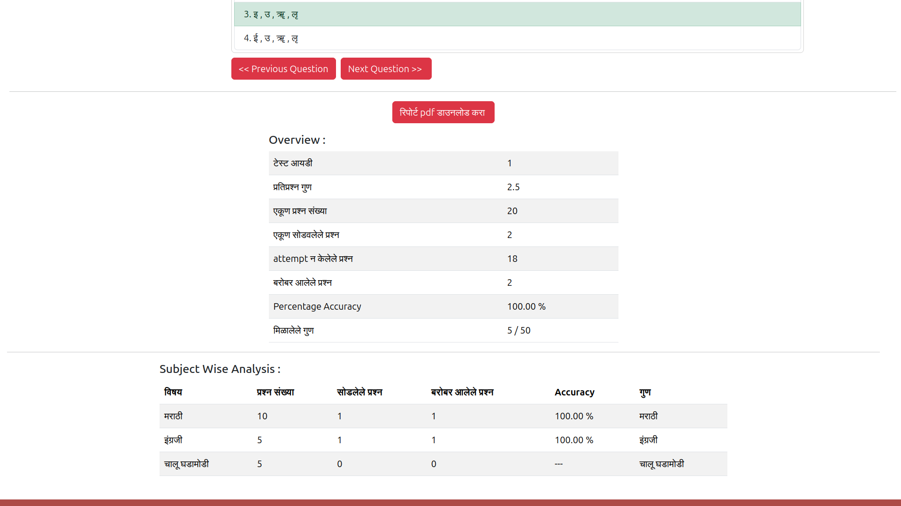

# Examwala Webapp Frontend

This is a react app created using 
`CRA` - `create react app`  

When you clone this repository, remember to add your personal data in `src/other/contactDetails.jsx` file.  
If you have some issues, feel free to contact me at `grvbng7@proton.me`

## Tech Stack
- Frontend : React JS
- Backend : Node Js 
- Database : MySql

## Note
- I have created backend and frontend for user flows only.
- Code for admin ( who will manage users and upload exam series is currently pending )
- So currently, you need to add data to database manually .
- you can find backend at : [examwala backend](https://github.com/grvbng7/examwala_backend)

## Preview 

### Homepage

### free test 

### exam UI

### Performance Report for test 

